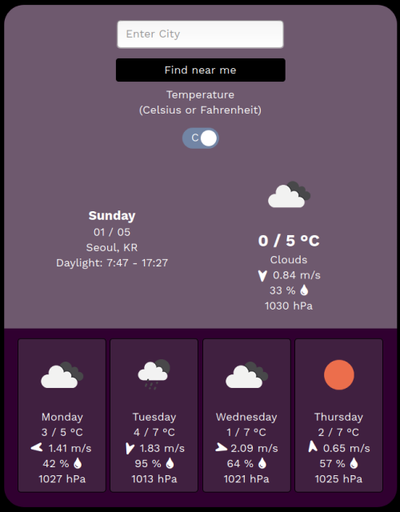

<h1 align="center">Welcome to Wonder Weather 👋</h1>

This is a Weather app focusing on the users who want to visit an outdoor place.<br />
Since wind information is one of the important factors of outdoor activity, it has an indicator of wind direction and speed.<br />
It gets weather information from [https://openweathermap.org](https://openweathermap.org) API (Application Programming Interface).<br />
The main requirement is [here](https://www.theodinproject.com/courses/javascript/lessons/weather-app).

+ [concept note](./docs/memo_begin.txt)
+ screenshot


## Function description

- Find weather near me
- Find weather with enter city

## Built With

- JavaScript (ES6)
- HTML 5
- CSS 3

## Getting Started
Since we cannot publish private API key, if you have your API key and want to contribute, follow this below:

1. create the file in the root directory of this project

```
$ touch db-config.json
```

2. fill in the JSON file
```
{ "OPEN_WEATHER_KEY": "(your API key of openweathermap.org)" }
```

5. npm install from root directory package.json
```
$ npm install
```

6. build and open server
```
$ npm run start
$ npm run server
```

## File dependencies
#### execution directory
```
./dist/index.html
```

#### other javascript source files
```
./src/
```

## Deployment

### ✨ [Live Demo](https://wonder-weather.netlify.com/dist)

## Author

👤 **Suhyeon Jang**

- Github: [@shjang7](https://github.com/shjang7)
- LinkedIn: [@shjang](https://www.linkedin.com/in/shjang/)
- Twitter: [@shjang12](https://twitter.com/shjang12)

## 🤝 Contributing

1. Fork it (https://github.com/shjang7/wonder-weather/fork)
2. Create your feature branch (git checkout -b feature/[choose-a-name])
3. Commit your changes (git commit -am 'what this commit will fix/add')
4. Push to the branch (git push origin feature/[chosen-name])
5. Create a new Pull Request

## License

This project is licensed under the MIT License - see the [LICENSE](./LICENSE) file for details
